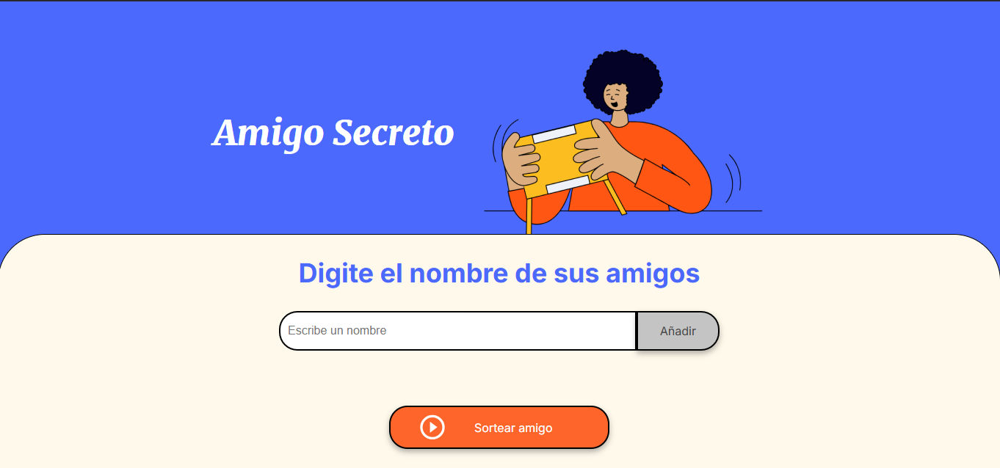

# 💛 Amigo Secreto 💛

Este proyecto es una aplicación web sencilla para gestionar y realizar sorteos de amigos secretos. Los usuarios pueden agregar nombres a una lista, gestionar la lista y seleccionar un amigo secreto de forma aleatoria.

### - Video explicando su funcionamiento
<video src="
https://github.com/user-attachments/assets/3839d0bc-fc00-4e49-8587-4efe4e126186 controls width="500">
</video>

## Funcionalidades

- Agregar y mostrar nombres de los participantes.
- Evitar entradas duplicadas en la lista.
- Limpiar la lista de participantes.
- Realizar un sorteo aleatorio para seleccionar un amigo secreto.
- Actualizaciones dinámicas e interacción usando JavaScript.

## Tecnologías Utilizadas

- **HTML5**: Para la estructura de la página web.
- **CSS3**: Para los estilos, con un diseño moderno y limpio.
- **JavaScript**: Para las interacciones y funcionalidades dinámicas.

## Estructura del Proyecto

- **`app.js`**: Contiene el código JavaScript que gestiona la lógica y las interacciones del usuario, como agregar nombres, limpiar la lista y seleccionar un amigo secreto.
- **`style.css`**: Contiene los estilos CSS, incluidos colores personalizados, fuentes y ajustes de diseño para una experiencia visual atractiva.
- **`index.html`**: (no proporcionado, pero asumido) Archivo HTML que estructura la interfaz de la aplicación.

## Configuración y Uso

1. Clona el repositorio o descarga los archivos del proyecto.
2. Asegúrate de que todos los archivos (`index.html`, `style.css` y `app.js`) estén en el mismo directorio.
3. Abre el archivo `index.html` en tu navegador web para ejecutar la aplicación.
4. Usa el campo de entrada para agregar los nombres de los participantes y haz clic en "Agregar" para incluirlos en la lista.
5. Haz clic en "Sortear" para seleccionar aleatoriamente un amigo secreto.
6. Usa el botón "Limpiar" para reiniciar la lista.

## Contenido de la Carpeta

- `app.js`: Archivo JavaScript con las funcionalidades de la app.
- `style.css`: Archivo CSS con los estilos de la app.
- `play_circle_outline.png`: Icono usado en el botón "Sortear".

## Aspectos Destacados del Diseño

- Diseño moderno y limpio utilizando variables CSS para un tema consistente.
- Interfaz intuitiva con retroalimentación visual clara.
